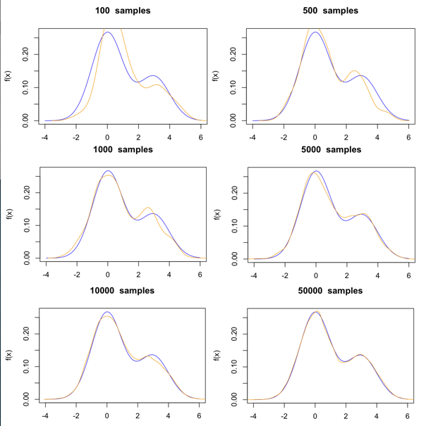
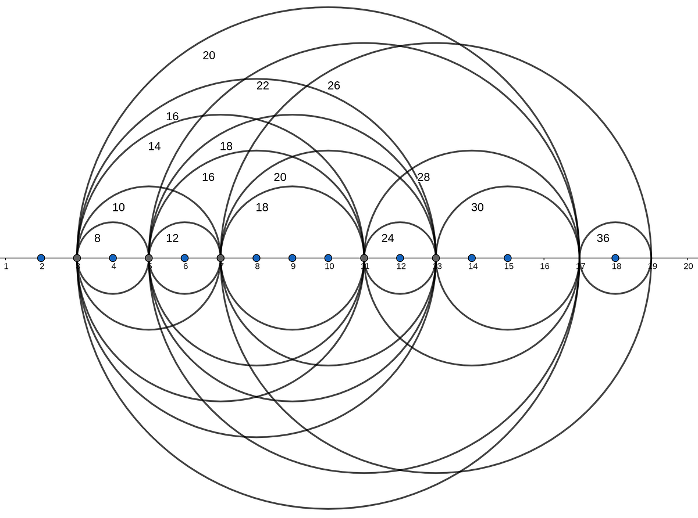

	

 

# 👨 About me

I am an actuary with a Bachelor's degree in Mathematics from the University of Montreal. I am currently on the path to becoming a Fellow of the Society of Actuaries (FSA) and a Fellow of the Canadian Institute of Actuaries (FICA). 

As a former software engineering student at Polytechnique Montreal, I am passionate about programming and data analysis. I have had the pleasure of working on various data analysis projects for the <a href="https://ofe-plateforme.com" target="_blank">Observatoire de la Francophonie Économique</a>, where I applied my data science skills to contribute to impactful global projects.

A member of the largest French-speaking fraternity in Canada, <a href="https://www.instagram.com/sigmathetapi.montreal?utm_source=ig_web_button_share_sheet&igsh=ZDNlZDc0MzIxNw==" target="_blank">Sigma Theta Pi</a>, I am actively involved in personal and professional development initiatives. My main areas of interest are stochastic calculus and Markov chains, which I have explored through several projects, including Markov Chain Monte Carlo (MCMC) methods, presented below.

Outside of my academic and professional pursuits, I am an enthusiast of weight training and boxing, and I also practice theater, which enhances my communication and personal expression skills.

For more information, please refer to my **<a href="https://github.com/Evenson0/Example/Evenson_Auguste_CV.pdf" target="_blank">full CV</a>**

 

# 📭 Contact

	

 

# 📂 Projects

## [📖 MCMC *(2024)*](https://github.com/Evenson0/Convergence-of-Monte-Carlo-Maximum-Likelihood-Calculations/blob/main/MCMC_Convergence.pdf)

This project is inspired by the work of Geyer, focusing on exploring Markov Chain Monte Carlo (MCMC) algorithms. We examine these algorithms even in cases with missing data, providing insights into handling incomplete datasets effectively. A key aspect of this project is demonstrating the convergence of the estimated maximum likelihood to the true maximum likelihood, highlighting the robustness of MCMC methods in complex statistical modeling.

### Supervisor : Gabriel Fortin-Leblanc

	

## [📘 Financial Mathematics *(2025 – ongoing)*](https://github.com/Evenson0/Financial-Mathematics)

This project is a **course in financial mathematics**, written and updated progressively.  
It includes **lecture notes, demonstrations, examples, exercises, and R code**.  
The course is structured in **R Markdown** (`.Rmd`) and compiled into **PDF** for easy reading.  
Topics range from simple and compound interest to annuities, bonds, and loan amortization, with an emphasis on clarity and rigor.

	

## [🔢 MathHub *(2025 – ongoing)*](https://github.com/Evenson0/MathHub)

MathHub is an **open mathematical archive** — a collection of **proofs, conjectures, problems, algorithms, and applications**.  
It is designed as both a **personal exploration** and a **collaborative project**, covering diverse areas:  
- Pure mathematics (number theory, analysis, algebra)  
- Problem-solving (Putnam-style, Olympiad problems)  
- Algorithms (Euclidean algorithm, Monte Carlo, optimization)  
- Applied mathematics (finance, statistics, probability models)  

The repository mixes **theory** and **practice**, with content in **Python (algorithms, models)** and **R (statistics, probability)**, complemented by structured notes in PDF.

	

